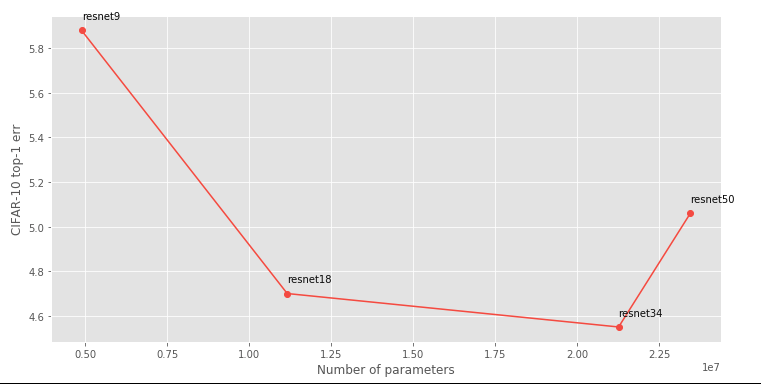
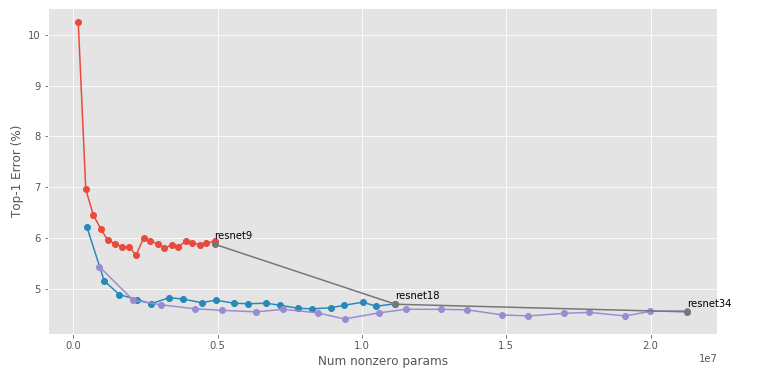

# [Learning both Weights and Connections for Efficient Neural Networks](https://arxiv.org/abs/1506.02626)

A PyTorch implementation of [this paper](https://arxiv.org/abs/1506.02626).

I'm currently in the process of updating this to work with the latest version of PyTorch! Currently the only network type that works is ResNet - other networks coming soon. 

To run, try:
```bash
python train.py --model='resnet34' --checkpoint='resnet34'
python prune.py --model='resnet34' --checkpoint='resnet34'
```

## Summary

Given a family of ResNets, we can construct a Pareto frontier of the tradeoff betwene accuracy and number of parameters:



Han et al. posit that we can beat this Pareto frontier by leaving network structures fixed, but removing individual parameters:


